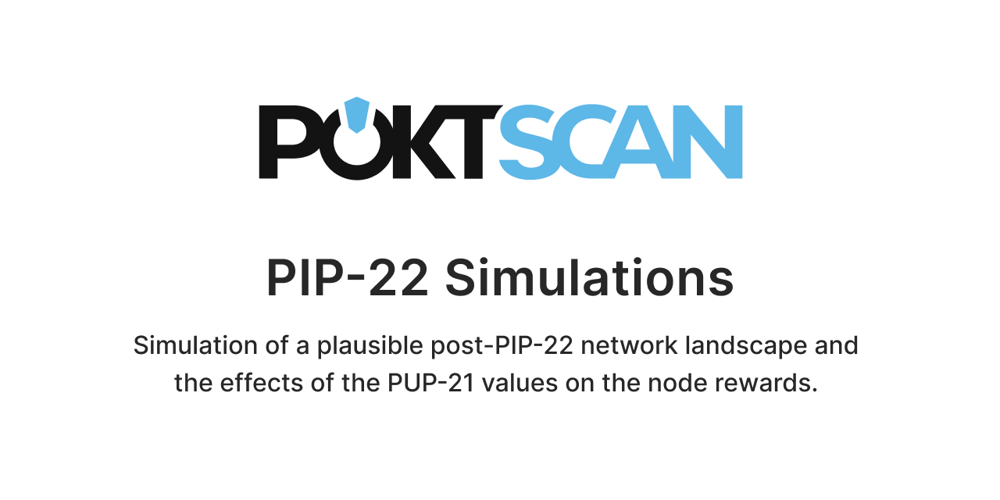

This repository contains the code of the POKTscan report on the PIP-22 proposal and the PUP-21 values. It is being released for the comunity in order to enable the exploration of the different PIP-22 scenearios.

## Abstract

This report summarizes the effects of the PIP-22 using the proposed parameters of PUP-21, a plausible set of assumptions and a Monte Carlo simulation of the Cherry Picker behavior. The results of this simulation suggest that in order to maintain the minted POKT levels constant after the implementation of the PIP-22, the expected rewards of a non-compounding node will be reduced by a $14 \%$ even in the higher performing nodes. The PUP-21 appears to have a harsher impact on the small node runners, punishing them if they are not able to compound their stake and reducing the rate of return for lower compound tiers in favor of higher rates of return for high compound tiers. A parameter change is needed in order to reduce the impact on the small nodes. We propose to enable the DAO to implement a non-linear weight staking. The proposed solution can be easily applied with minor changes on the PUP-21 and no code changes on the PIP-22.

Keywords: POKT network · PIP-22 · PUP-21 · Simulation.